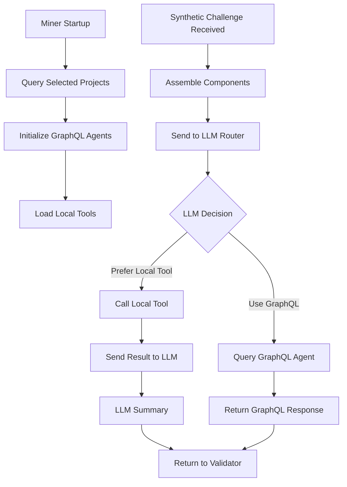

# Miner Architecture Documentation

## Overview

This document describes the architecture and flow of synthetic challenges within the Miner component of the network.

## Miner Synthetic Challenges Flow

## Detailed Process Flow

### 1. Miner Initialization

When the miner starts up, it performs the following initialization steps:

1. **Query Selected Projects**: Retrieve all selected projects from the board service
2. **Initialize GraphQL Agents**: Create a GraphQL agent instance for each project
3. **Load Local Tools**: Load miner's local tool code for each project from the local directory `./projects/miner/[projectId]/tools.py`

### 2. Synthetic Challenge Processing

When a synthetic challenge is received:

1. **Component Assembly**: Combine GraphQL agents and local tools
2. **LLM Routing**: Send the assembled components to the LLM router
3. **LLM Decision Making**: The LLM prioritizes local tool usage based on prompts

### 3. Response Generation

The LLM has two primary paths for generating responses:

#### Local Tool Path
- LLM selects a local tool
- Tool is executed with the challenge parameters
- Results are sent back to LLM for summarization
- Final summary is returned to the validator

#### GraphQL Path
- LLM decides to use GraphQL for the response
- Query is sent to the appropriate GraphQL agent
- GraphQL response is directly returned to the validator

## Key Components

### GraphQL Agent
- Handles project-specific GraphQL queries
- Maintains connection to project data sources
- Provides structured data access

### Local Tools
- Project-specific tool implementations loaded from `./projects/miner/[projectId]/tools.py`
- Custom logic for data processing
- Miner-owned functionality

### LLM Router
- Intelligent routing of challenges
- Decision making based on prompts
- Coordination between tools and agents

## Architecture Benefits

1. **Flexibility**: Supports both local tool execution and GraphQL queries
2. **Modularity**: Clean separation between tools and agents
3. **Scalability**: Easy to add new projects and tools
4. **Intelligence**: LLM-based decision making for optimal response generation